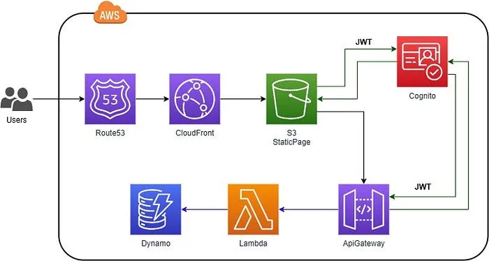

# Legal Case Management System

## 📌 Overview

The **Legal Case Management System** is a serverless web application designed to streamline the process of registering and managing legal cases. The system enables **Back Office (BO) Officers** to register cases and assign them to **Field Investigation Officers (FIOs)**, who conduct investigations and provide necessary documentation. The **Admin** receives updates on all case activities via email notifications.

This application leverages AWS serverless technologies to provide a scalable, cost-effective, and highly available solution.

---

## 🏗️ Architecture

The project is built using AWS Serverless technologies:



### **Frontend (React Website Hosting)**

- **Amazon S3** - Hosts the static React application.
- **Amazon CloudFront** - Provides secure and fast content delivery.
- **AWS Certificate Manager (ACM)** - Manages SSL/TLS certificates.
- **Amazon Route 53** - Configures custom domain and DNS management.

### **Backend**

- **Amazon API Gateway** - Serves as an entry point for client requests.
- **AWS Lambda** - Executes business logic for handling case management operations.
- **Amazon DynamoDB** - NoSQL database for storing case details, user information, and logs.

### **Additional AWS Services**

- **Amazon Simple Email Service (SES)** - Sends email notifications about case updates.
- **Amazon S3** - Stores case-related documents, images, and evidence.
- **AWS Cognito** - Handles user authentication and authorization (if applicable).

---

## 🎯 Features

✅ **Case Registration**: BO Officers can register new cases in the system.

✅ **Case Assignment**: Assign cases to FIOs for field investigation.

✅ **Investigation Reporting**: FIOs can upload investigation details, findings, and supporting documents.

✅ **Admin Notifications**: Admins receive real-time email updates regarding case status.

✅ **Document Storage**: Secure storage of investigation documents and reports in Amazon S3.

✅ **Secure and Scalable**: Fully serverless architecture for high availability and cost efficiency.

✅ **Audit Logging**: Logs all case-related actions for security and compliance.

✅ **Multi-Environment Support**: Easily deployable to development, staging, and production environments.

✅ **Role-Based Access Control (RBAC)**: Ensures different user roles (Admin, BO Officer, FIO) have appropriate permissions.

✅ **CI/CD Implementation**: Automated deployment pipeline using GitLab CI/CD for seamless updates.

---

## 🛠️ Technologies Used

- **Frontend**: React.js, TypeScript
- **Backend**: AWS Lambda (Node.js/Python)
- **Database**: Amazon DynamoDB
- **Authentication**: AWS Cognito
- **Storage**: Amazon S3
- **Notification**: Amazon SES
- **CDN & Security**: Amazon CloudFront, Route 53, ACM
- **Infrastructure as Code**: Terraform & Terragrunt

---

## 🚀 Deployment

### **Prerequisites**

- AWS CLI installed and configured
- Node.js and npm/yarn installed
- Terraform/Terragrunt for Infrastructure as Code (optional)
- Git for version control

### **Steps to Deploy**

#### **Frontend Deployment**:

```bash
# Install dependencies
npm install

# Build the React project
npm run build

# Sync build files to the S3 bucket
aws s3 sync ./build s3://your-s3-bucket-name --delete

# Invalidate CloudFront cache to reflect new updates
aws cloudfront create-invalidation --distribution-id YOUR_DISTRIBUTION_ID --paths "/*"
```

#### **Backend Deployment**:

```bash
# Deploy API Gateway, Lambda, and DynamoDB using Terraform/Terragrunt
cd infrastructure
terraform init
terraform apply -auto-approve
```

## CI/CD Pipeline:

- Implemented using GitLab CI/CD for automatic deployments.

- Upon code commits, the pipeline builds and deploys updates to AWS services.

- Separate environments for development, testing, and production.

#### **Domain Setup**:

- Use Amazon Route 53 to manage custom domains and subdomains.
- Configure SSL certificates using AWS ACM.

---

## 🏆 Future Enhancements

🔹 Add **real-time notifications** using AWS SNS or WebSockets. 
🔹 Introduce **multi-language support** for wider usability. 
🔹 Implement **AI-based case analysis and reports** for better decision-making. 

---

## 🤝 Contributing

Contributions are welcome! Please follow these steps:

1. Fork the repository.
2. Create a new branch for your feature (`feature-branch-name`).
3. Commit your changes with descriptive messages.
4. Push your changes and create a pull request.

---

---

## 📜 License

This project is licensed under the [MIT License](LICENSE).

---

## 📞 Contact

For any questions or feedback, feel free to reach out:
## 📞 Contact

For any questions or feedback, feel free to reach out:
<table border="0" cellspacing="0" cellpadding="0">
  <tr>
    <td valign="top">
      <strong>Mayur Sabade</strong>
      <ul>
        <li><strong>Email:</strong> <a href="mailto:sabademayur@gmail.com">sabademayur@gmail.com</a></li>
        <li><strong>LinkedIn:</strong> <a href="https://www.linkedin.com/in/mayur-sabade">linkedin.com/in/mayur-sabade</a></li>
        <li><strong>GitHub:</strong> <a href="https://github.com/mayur0319">mayur0319</a></li>
      </ul>
    </td>
    <td valign="top" style="padding-left: 90px;">
      <strong>Pranav Patil</strong>
      <ul>
        <li><strong>Email:</strong> <a href="mailto:pranavpatil8017@gmail.com">pranavpatil8017@gmail.com</a></li>
        <li><strong>LinkedIn:</strong> <a href="https://www.linkedin.com/in/pranav-patil-1014641a7">linkedin.com/in/pranav-patil</a></li>
        <li><strong>GitHub:</strong> <a href="https://github.com/Pranav-Patill">Pranav-Patill</a></li>
      </ul>
    </td>
  </tr>
</table>


